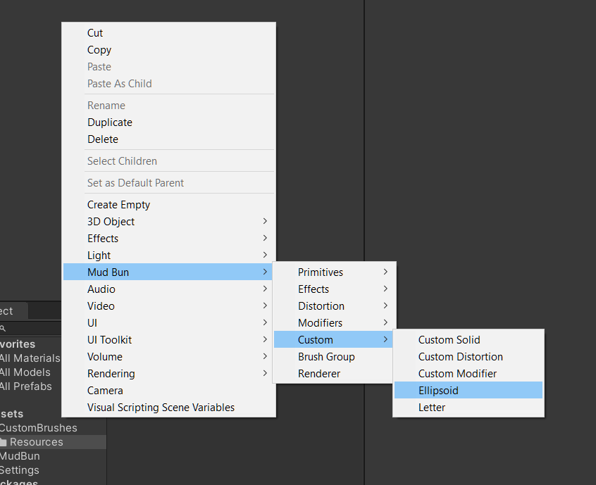

MudBun must be installed from the Package Manager for this repo to work.

You will get some errors saying "Unsafe code may only appear if compiling with /unsafe. Enable "Allow 'unsafe' code" in Player Settings to fix this error."

Personally I don't have a problem with allowing unsafe code, but if you do, instead you can remove the unsafe code in MudLetter and MudEllipsoid, since it's only used for CPU raycasts and such. The lines that need to be removed are labeled in those files. Otherwise do what error says.

MudEllipsoid is just a copy of MudSphere that uses a Vector3 field to set it's size instead of the object's scale. It's meant to be a simple example for how to make a custom brush.

In the right-click menu under MudBun/Custom you'll find Ellipsoid and Letter.



The Ellipsoid will render fine because it's using the same code as the existing Sphere brush, but the Letter won't render at all.

To get the letter to render, you need to edit the file "MudBun/Customization/CustomBrush.cginc".

In that file, under line 14 where it says `#include "../Shader/SDF/Primitives.cginc"`, paste this:

`#include "Assets/CustomBrushes/SdfLetter.cginc"`

So the first section of CustomBrush.cginc should look like this:


Then go down to line 96 in the same file, and copy/paste the following code:

```
case kLetter:
{
  res = sdf_letter(pRel, h, brush.data0.x, brush.data0.yz, brush.data0.w, brush.data1.x) - brush.radius;
  break;
}
```

It should look like this, paying close attention to the closing curly braces:


Right now it is necessary to add a new case to this switch statement whenever a brush is added. The dev of MudBun is looking at ways of automating this process, since it is error prone.

Whenever you update MudBun, you will have add these lines back to CustomBrush.cginc.

